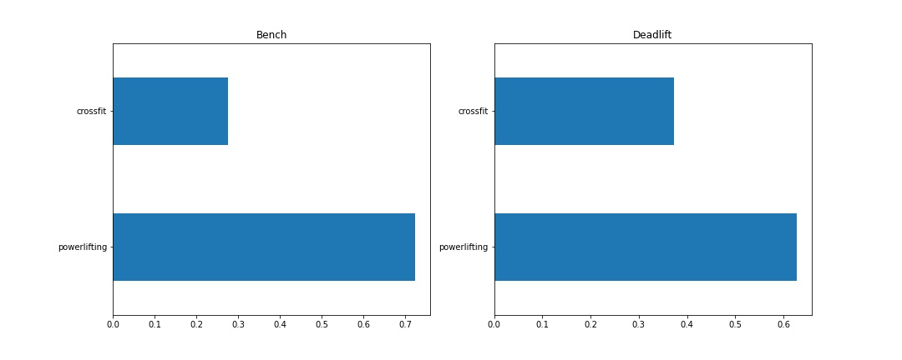
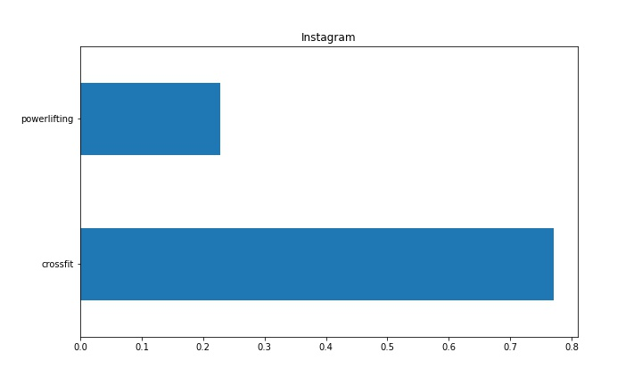
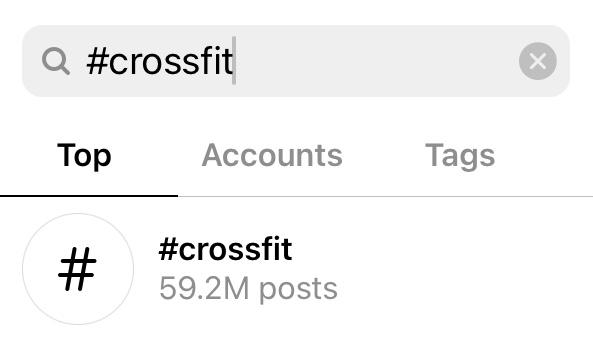
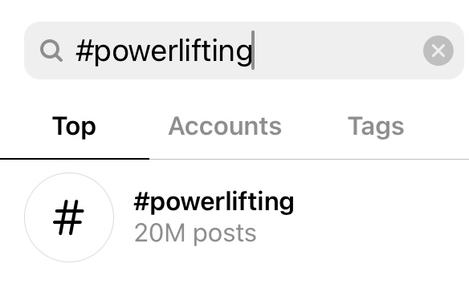

# Purposes
This is a practice project for using NLP.  
Since NLP can be used for text classification, I decided to choose two somewhat similar subreddits from Reddit and see if posts from either subreddit can be correctly classified.  
I chose these two subreddits ([/r/crossfit](https://www.reddit.com/r/crossfit) and [/r/powerlifting](https://www.reddit.com/r/powerlifting)) because from my years of crossfit training I know the two training styles share a lot in common, but have different focuses at the same time. so I wanted to see if they can be classfied and how.

# Data
5,939 reddit posts were initially scraped (2,997 from subreddit crossfit and 2,942 from subreddit powerlifting).  
Upon a value check, the following issues were identified:
1. Lots of posts tagged as either [removed] (1521) or [deleted] (42) in the body;
2. Lots of duplicates in both the title and body;
3. Quite a few spams;
4. Ads such shopping websites 

2,097 posts were kept after the cleaning (1,761 from crossfit and 336 from powerlifting, very imbalanced). 
And the modeling and analysis were based on 'selftext' (the body) alone, and the target was the 'subreddit' column which is binary. 

# What's included in the repo
**/data (folder)**:  
<ul>
    <li>posts.csv: the original 5939 posts
    <li>posts_clean.csv: cleaned version with 2097 posts
</ul>

**/images (folder)**:  
<ul>
    <li>bench_deadlift_mention.jpg: mention of both keywords "bench" and "deadlift" in the two subreddits
    <li>crossfit.jpg: #crossfit on Instagram
    <li>powerlifting.jpg: #powerlfiting on Instagram
    <li>Instagram.jpg: mention of "Instagram" in the two subreddits
</ul>

**/models (folder)**: all the models saved with pickle

**Project 3 - Subreddits.pdf**: the slide deck

**Readme.md**: this file

**subreddit_analysis.ipynb**: the analysis notebook

**subreddit_scraping.ipynb**: the scraping notebook
</ul>

# What did I do?
Data was not given for this project, so I needed to both scrap the reddit posts and do analysis.

### Part 1: Data Scraping
[Pushshift's API](https://github.com/pushshift/api) was used for data scraping with 'fields' set to 'created_utc' (for time track), 'title' (which was dropped before modeling) and 'selftext' (the body) only.  
The scraping was interrupted a few times due to json encoding problems, so it wasn't a very plansant step. 

### Part 2: Modeling & Evaluation
Seven classifiers were tried out in GridSearchCV with CountVectorizer and StandardScaler for preprocessing for this project:
1. Logistic Regression
2. KNN
3. Decision Tree
4. Random Forest
5. Naive Bayes
6. SVM
7. Gradient Boosting

F1 scores from both the train and test set for all models were generated because this dataset is very imbalanced and I wanted to focus on both the positives and negatives.
The scores are listed below sorted by f1 score from the test set: 

|Classifier|train f1|test f1|
|---|---|---|
|Gradient Boosting|0.964784|0.954048|
|Decision Trees|0.954895|0.945856|
|Random Forest|0.953413|0.942060|
|SVM|0.951965|0.940152|
|Naive Bays|0.944635|0.936508|
|Logistic Regression|0.965771|0.935800|
|KNN|0.924382|0.914826|

All of the models perform and generalize well enough. Gradient Boosting was selected as the final pick for its performance on the test set and tolerable overfitting. 

# Findings

1. 'crossfit' and 'powerlifting' are among the top5 keywords for classifying these two subreddits, together with 'bench' (for bench press) and 'deadlift' as two of the most frequently mentioned movements.

2. 'Instagram' was number 5 on the list which was both surprising and understandable, although it doesn't carry as much weight (0.03) as the other four keywords do (0.11 - 0.27). 77% of all posts that mentioned 'Instagram' were from crossfit and 23% from powerlifting, which is a 3:1 ratio.

Then I went ahead and checked the number of posts with #crossfit and #powerlifting on Instagram. Another 3:1 ratio was observed.

# Possibilities
I don't have lots of insight out of this project, as it was mainly of personal interest. But since it was observed that crossfit is a more expressive and visual identification on Instagram, advertisers can target those who are into crossfit on Instagram more easily than on those who are into powerlifting. 